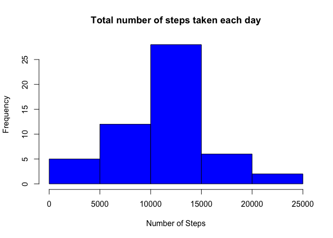
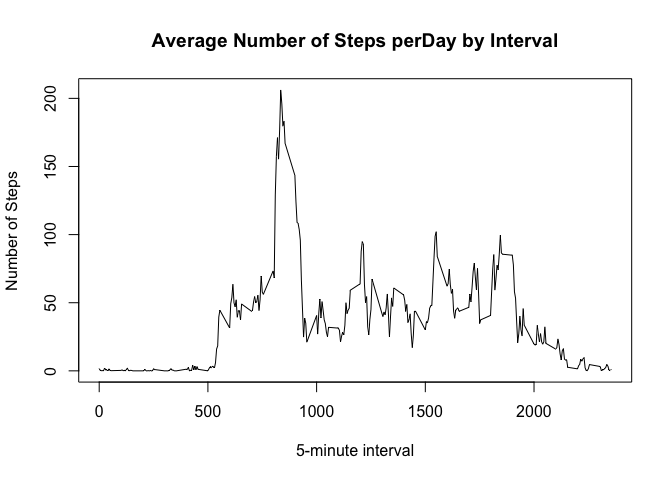
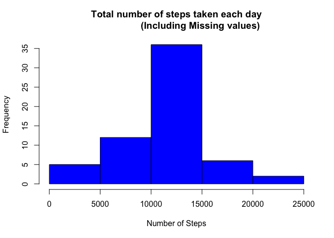
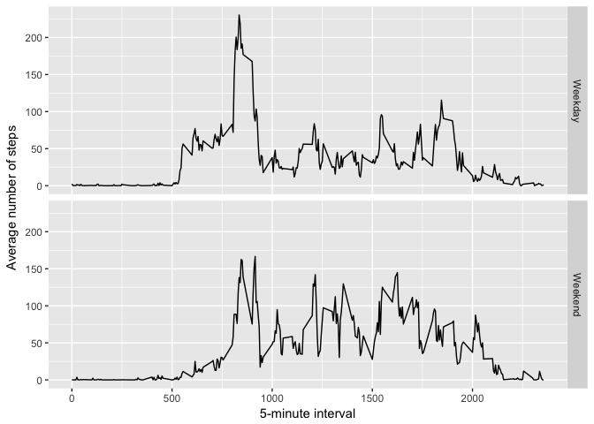

# Reproducible Research: Peer Assessment 1
## Purpose 
This Project makes use of data from a personal activity monitoring device. 
The device collects data at 5 minute intervals through out the day. The data consists of two months of data from an anonymous individual collected during the months of October and November, 2012 and include the number of steps taken in 5 minute intervals each day.

Following R code will Process,Load,Calculate Mean and median number of steps taken each day.It also Produces difference in activity patterns between weekdays and weekends

## Loading and preprocessing the data


```r
library(plyr)
if(!file.exists('activity.csv')){
    unzip('activity.zip')
}
activitydata <- read.csv("activity.csv")
activitydata$date<- as.Date(activitydata$date)
head(activitydata)
```

```
##   steps       date interval
## 1    NA 2012-10-01        0
## 2    NA 2012-10-01        5
## 3    NA 2012-10-01       10
## 4    NA 2012-10-01       15
## 5    NA 2012-10-01       20
## 6    NA 2012-10-01       25
```

## What is mean total number of steps taken per day?

```r
steps_by_day <- aggregate(steps ~ date, activitydata, sum)
hist(steps_by_day$steps,
     main = paste("Total number of steps taken each day"),     
     col="blue", xlab="Number of Steps")
```

<!-- -->

```r
rmean <- mean(steps_by_day$steps)
rmean
```

```
## [1] 10766.19
```

```r
rmedian <- median(steps_by_day$steps)
rmedian
```

```
## [1] 10765
```
  
## What is the average daily activity pattern?

```r
steps_by_interval <- aggregate(steps ~ interval, activitydata, mean)
plot(steps_by_interval$interval,steps_by_interval$steps, type="l",     
     xlab="5-minute interval", ylab="Number of Steps",
     main="Average Number of Steps perDay by Interval")
```

<!-- -->

####1. Which 5-minute interval, on average across all the days in the dataset, contains the maximum number of steps?   

```r
max_interval <- steps_by_interval[which.max(steps_by_interval$steps),1]
```
The max_interval is 835.

## Imputing missing values
##### 1. Calculate total number of missing values in the dataset:

```r
sum(is.na(activitydata$steps))
```

```
## [1] 2304
```
##### 2.Filling in all of the missing values in the dataset and Creating a new dataset that is equal to the original dataset but with the missing data filled in.

```r
activitydata_new<- activitydata
missingVector<- is.na(activitydata_new$steps)
avg_interval<- tapply(activitydata_new$steps, activitydata_new$interval, mean, 
                      na.rm=TRUE, simplify = TRUE)
activitydata_new$steps[missingVector] <-  
        avg_interval[as.character(activitydata_new$interval[missingVector])]
head(activitydata_new)
```

```
##       steps       date interval
## 1 1.7169811 2012-10-01        0
## 2 0.3396226 2012-10-01        5
## 3 0.1320755 2012-10-01       10
## 4 0.1509434 2012-10-01       15
## 5 0.0754717 2012-10-01       20
## 6 2.0943396 2012-10-01       25
```
##### 3.Calulating mean and Median of New Data Set

```r
steps_by_day_new <- aggregate(steps ~ date, activitydata_new, sum)
rmean_new <- mean(steps_by_day_new$steps,na.rm=TRUE)
rmean_new
```

```
## [1] 10766.19
```

```r
rmedian_new <- median(steps_by_day_new$steps,na.rm=TRUE)
rmedian_new
```

```
## [1] 10766.19
```
**Note - With filling missing data -mean and the median are same**.

##### 4.Creating Histogram of New Data Set

```r
steps_by_day_new <- aggregate(steps ~ date, activitydata_new, sum)
hist(steps_by_day_new$steps,
     main = paste("Total number of steps taken each day
                  (Including Missing values)"),     
     col="blue", xlab="Number of Steps")
```

<!-- -->

## Are there differences in activity patterns between weekdays and weekends?

```r
weekdays <- c("Monday", "Tuesday", "Wednesday", "Thursday", "Friday")
activitydata_new$weektype = 
        as.factor(ifelse(is.element(weekdays(as.Date(activitydata_new$date)),
                                    weekdays), "Weekday", "Weekend"))

head(activitydata_new)
```

```
##       steps       date interval weektype
## 1 1.7169811 2012-10-01        0  Weekday
## 2 0.3396226 2012-10-01        5  Weekday
## 3 0.1320755 2012-10-01       10  Weekday
## 4 0.1509434 2012-10-01       15  Weekday
## 5 0.0754717 2012-10-01       20  Weekday
## 6 2.0943396 2012-10-01       25  Weekday
```

```r
steps_by_interval_new <- aggregate(steps ~ interval + weektype , 
                                   activitydata_new, mean)
library(ggplot2)
ggplot(steps_by_interval_new, aes(interval, steps)) + 
    geom_line() + 
    facet_grid(weektype ~ .) +
    xlab("5-minute interval") + 
    ylab("Average number of steps")
```

<!-- -->

